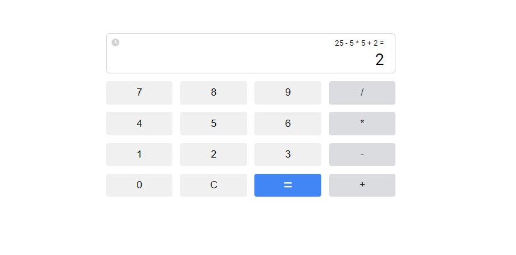
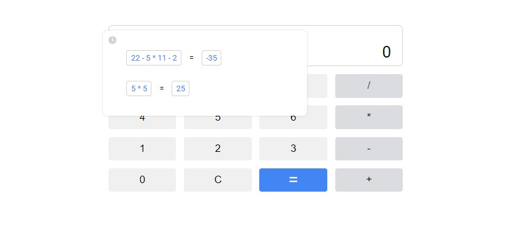

<h1 align="center"><i>Simple Calculator</i></h1>

 A simple calculator providing the four basic arithmetic operations - multiplication, division, addition, and subtraction. The user can view and use results of previous calculations, and the calculator provides a good user experience and a responsive interface.

<h2 align="center"><i>Screenshots</i></h2>

    
    
    

<h2 align="center"><i>Technologies </i></h2>

This project uses React, a popular JavaScript library, to create a dynamic and responsive user interface.

<h2 align="center"><i>Features</i></h2>

The calculator includes the following features:

<ul>
    <li>Perform four basic arithmetic operations - multiplication, division, addition and subtraction</li>
    <li>Results history state management</li>
    <li>Buttons press/click effect</li>
</ul>

<h2 align="center"><i>How to run the app</i></h2>

<ol>
    <li>Download the repository content in a ZIP file.</li>
    <li>Open the project in a suitable IDE, such as VS Code.</li>
    <li>Navigate to the project folder and run the command "npm install" to install all the dependencies.</li>
    <li>After all dependencies are installed, run the command "npm start" to start the app.</li>
</ol>
